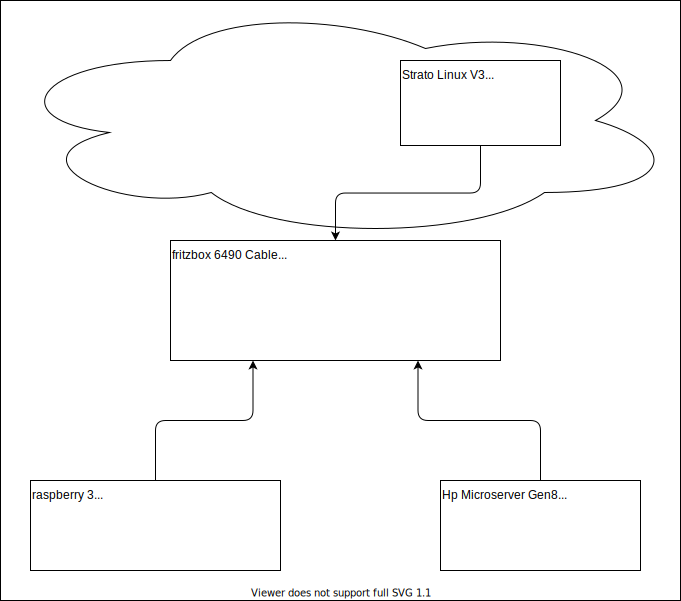

# Infrastructure

My local infrastructure with external access through VPN.

The main goal of my server is to offer a nextcloud for family usage and using raid disks as data storage through smb with possible access from outside.
The rest around this project is just for fun.


## Overview



## Create certificates
```
certbot certonly --server https://acme-v02.api.letsencrypt.org/directory -d "*.${WILDCARD_DOMAIN}" --email "$MY_MAIL" --preferred-challenges dns --manual --config-dir ./letsencrypt --work-dir ./letsencrypt --logs-dir ./letsencrypt
```