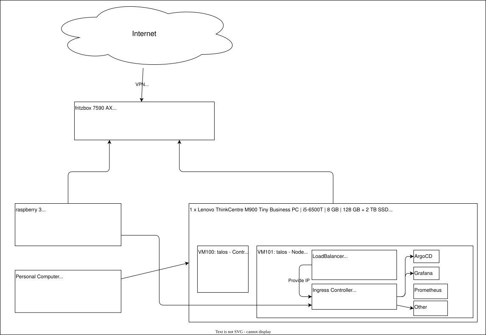

# Infrastructure

My local infrastructure with external access through a VPN.

The main goal of my server is to host a Nextcloud instance for family use. Running Kubernetes and all the monitoring tools is mostly for fun and learning purposes.

## Hardware
For the setup, I use my FritzBox to provide VPN access via WireGuard. Additionally, I configured a local IP as a DNS entry. This points to my Raspberry Pi, which uses **dnsmasq** to route certain domains to local IPs.  

For my single-node Kubernetes cluster, I use a **Lenovo ThinkCentre M900 Tiny Business PC** with the following specs:
- CPU: i5-6500T  
- Memory: 8 GB  
- SSD: 128 GB + 2 TB  

## Overview
The FritzBox uses the Raspberry Pi’s IP address as its DNS entry. Therefore, all devices in my network use the Raspberry Pi as their DNS by default. The Raspberry Pi runs **dnsmasq**, which routes all domains with an ingress record to the Traefik load balancer IP.  

On the ThinkCentre, I installed **Proxmox** to create multiple virtual machines. I set up two VMs running **Talos Linux**—these form my single-node Kubernetes cluster with a dedicated control plane.  

For load balancing, I use **MetalLB**. **Traefik** serves as the ingress controller. For monitoring and logging, I added **Prometheus**, **Grafana**, and **Loki**. For continuous deployment, **ArgoCD** is running. To deploy my custom “vibe-coded” tools, I set up a simple **Docker registry**.

### Persistence
For persistence, I manually installed a **Network File System (NFS)** on Proxmox. The 2 TB SSD is shared as an NFS volume and used as a persistent volume in Kubernetes.

### Notifications
For alerting, I use the Docker image **bbernhard/signal-cli-rest-api**. I have a dedicated number that sends notifications to my personal phone.

### SSL Certificates
My domains are hosted on **Strato**. I use [Buxdehuda/strato-certbot](https://github.com/Buxdehuda/strato-certbot.git) in a cron job to keep my wildcard certificates up to date.  
Since my services are not publicly accessible, I use the **DNS challenge** method. Because this process is error-prone, I have an additional cron job that checks daily if the certificate is valid for more than 20 days. If not, I receive a daily notification.

### Software Updates
**Kubernetes**, **Talos**, and **Proxmox** are updated manually whenever I have time.  
For all Kubernetes resources, including Helm charts, I run a **Renovate bot** once a week that creates pull requests for any outdated software.

### Nextcloud
The main purpose of the setup is running **Nextcloud**. It is deployed using a Helm chart. The database runs via the **MariaDB** Helm chart. All data is stored on the 2 TB SSD through a persistent volume.

## Kubernetes
All manifests (except secrets) deployed on my single-node cluster are managed by **ArgoCD**.

## kidcalendar, video-viewer, wishlist
These are simple web apps for an iPad, created for my kids. I built them using my **vibe coding** tools.

## sensor
Code for an **ESP32** equipped with CO₂, temperature, and humidity sensors. The ESP32 exposes an API that provides Prometheus-compatible metrics.  
Prometheus collects the data, and Grafana displays it on a dashboard. I deployed the code to multiple boards to monitor several rooms. When CO₂ levels get high, I receive a Signal message.

## signalWebhook
A simple web service that converts Grafana webhook alerts into Signal messages.

# License
This project is licensed under the MIT License - see the [LICENSE](LICENSE) file for details.
